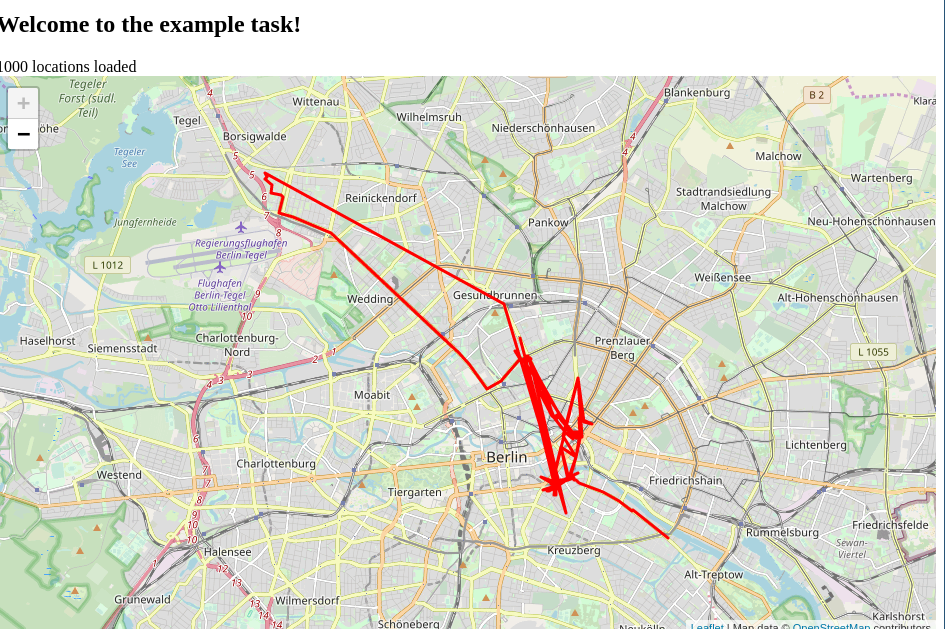

Welcome to the example task for the full-stack position at [IMPARGO](https://impargo.de/en/). Please read these instructions
carefully. If you have any questions please write me an e-mail at
j.labeit@impargo.de.

# Overview
Recently we launched the IMPARGO DriverApp with which drivers can receive
orders from their dispatchers and their location can be tracked. Right now
the dispatchers only can see the current location of the driver - no historic
data. This example task is about showing historic tracking data to
dispatchers on a leaflet map.

The application has two parts
- The client (in the `client` directory) a react front-end used to display the historic data on the map.
- The server (in the `server` directory) a nodejs server used to retrieve and process the historic data.

# Getting started
Before you start you should have a recent version of `npm` and `node`
installed.
To start the server go into the `server` directory and run
```
  npm install
  node index.js
```
To see whether the server works check <http://localhost:3000> and see if you
get a JSON object with a example tracking data.

To build the client go into the directory `client` and run
```
npm install
npm run start
```
Then the font-end should automatically open in your browser (localhost:8080). Make sure that
the server is still running! Now you sould see a visual representation of the
tracking data on a map.

It should look like this: 

# Task 1 - Splitting data into segments
**Motivation**
As you can see when clicking on the red line on the map the tracking data
spans multiple days. It's unclear when a trip starts or ends. To give dispatchers
a better overview over the trips the driver has taken in recent history it
would be helpful to split the tracking data into trips and display them
separatly on the map.

**Solution**
1. Change the server (`server/index.js`) so that the tracking data is
split into multiple arrays (segments). One way to split the array is by using
the `time` property. When the time gap exceeds a certain treshhold a new
segment begins. Each segment then should be one tracked trip. If you find a different
way to split the array into trips feel free to implement it instead.

2. Adapt the front-end (`client/src/map_container.js`) so that the different
segments are displayed on the map in a different style. For example use
different colors for different segment.

After finishing task 1 please make a commit with a commit message that
indicates that the task is finished.

# Task 2 - Going back in time
**Motivation**
Sometimes dispatchers are intereseted to lookup the driver location at a specific
time in the past. For example where was the driver yesterday at 13:00?

**Solution**
1. Add the `/location/:when` GET route to the server (`server/index.js`)
which takes a datetime string as query parameter `when` and returns the
tracking data closest to this time.
2. Add a slider to the front-end
(`client/src/index.js` and possibly a new file) which can be used to select a
time in the past. Choose a sensible time range so that tracking data is
available for this range. Pass the selected time as prop to the map
container.
3. Adapt the map container (`client/src/map_container`) to fetch the data
matching to the selected time and display the result on the map. For example a [leaflet marker](https://leafletjs.com/reference-1.5.0.html#marker) can be used to display the location.

Again once finished with task 2 make a commit that indicated task 2 has been finished. 

# Notes
- You are free to install new packages if it makes sense.
- If you want to adapt styling you can do so by changing `client/src/styles.css`.
- If you have an idea to solve a task in a better way feel free to do so. 

Happy coding!
